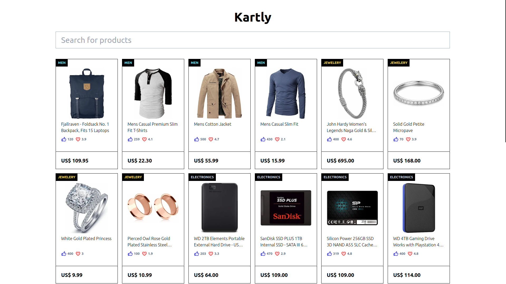

# Kartly - Online Shopping Center

Kartly is an online shopping app developed using the Next.js framework. It allows users to browse products from various categories, check the product details and search through them.

## Tech stacks and utility tools

- Next.js

- React

- Tailwind CSS

- Git-hooks

- Prettier

- TanStack Query

- Git-flow

## Screenshot

